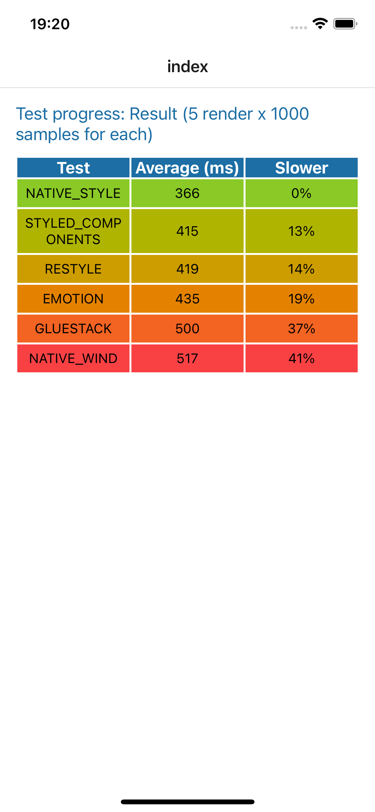

## React Native CSS/StyleSheet Frameworks Benchmark

### Requirements
- Node v20.11.0
- Yarn
- Xcode

### Start

```shell
yarn install
```

```shell
yarn ios
```

### Output

| Test                | Average | % Slowdown |
|---------------------|---------|------------|
| Twrnc               | 401     | 0          |
| Native StyleSheet   | 407     | 1%         |
| Styled Component v6 | 448     | 12%        |
| Unistyle            | 452     | 13%        |
| Restyle (shopify)   | 454     | 13%        |
| Emotion             | 468     | 17%        |
| GlueStack           | 516     | 29%        |
| NativeWind          | 543     | 35%        |



### Benchmark Test Overview

The tests were conducted to measure the average rendering time of different styling methods in a controlled React Native environment. Each framework was tested under identical conditions to ensure fair comparison. The metrics were calculated based on the rendering speed, focusing on how much slower each framework is compared to the native StyleSheet implementation in React Native.

### Interpretation

- **Native StyleSheet:** Serves as the baseline for this benchmark, showing the performance of React Native's built-in styling solution.
- **Styled Component v6:** Exhibits a 13% slowdown compared to Native StyleSheet, indicating a relatively minor performance impact for its additional features.
- **Restyle (Shopify):** Has a 14% slowdown. It's a bit slower than Styled Component v6 but still offers competitive performance.
- **Emotion:** Shows a 19% slowdown. This is slightly higher, reflecting its more complex features.
- **GlueStack:** With a 37% slowdown, it's significantly slower than the native solution, which might be a trade-off for its specific features.
- **NativeWind:** The slowest in this benchmark, with a 41% slowdown. This might be due to its extensive feature set and complexity.

### Conclusion

This benchmark provides valuable insights into the performance trade-offs of using different CSS/StyleSheet frameworks in React Native applications. While native StyleSheet offers the best performance, other frameworks bring various features and syntactic advantages that may justify their use despite the performance overhead.

---
