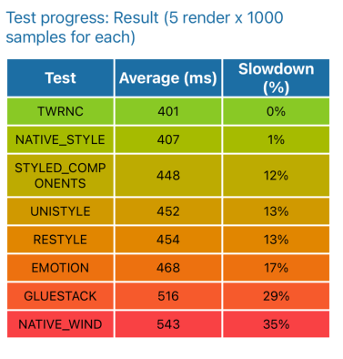

## React Native CSS/StyleSheet Frameworks Benchmark

### Requirements
- Node v20.11.0
- Yarn
- Xcode

### Start

```shell
yarn install
```

```shell
yarn ios
```

### Output


| Test                | Average | % Slowdown |
|---------------------|---------|------------|
| Native StyleSheet   | 366     | 0          |
| Styled Component v6 | 415     | 13%        |
| Restyle (shopify)   | 419     | 14%        |
| Emotion             | 435     | 19%        |
| GlueStack           | 500     | 37%        |
| NativeWind          | 517     | 41%        |



